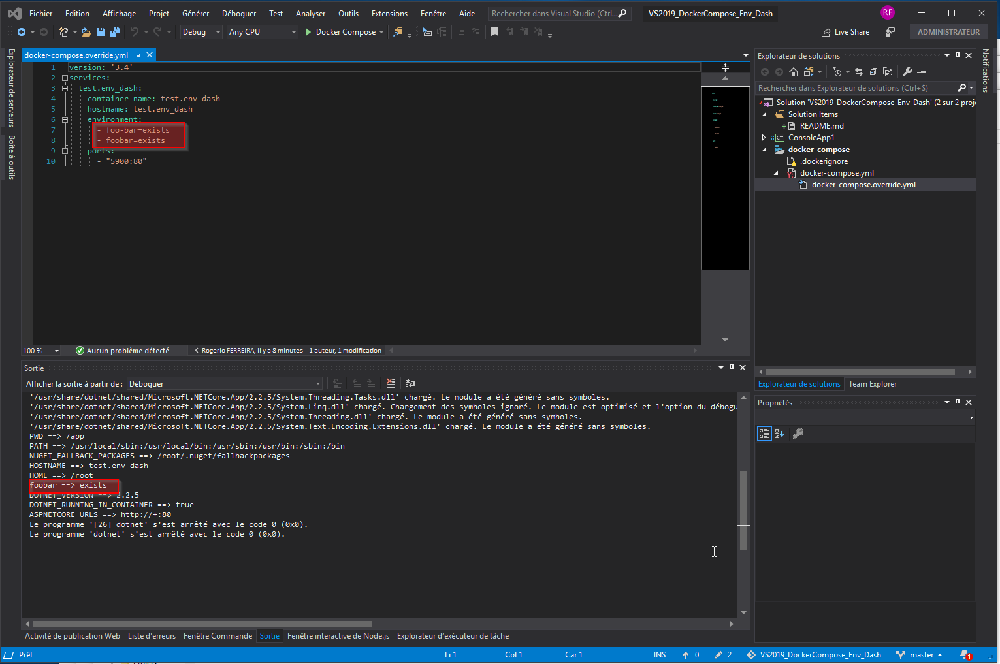
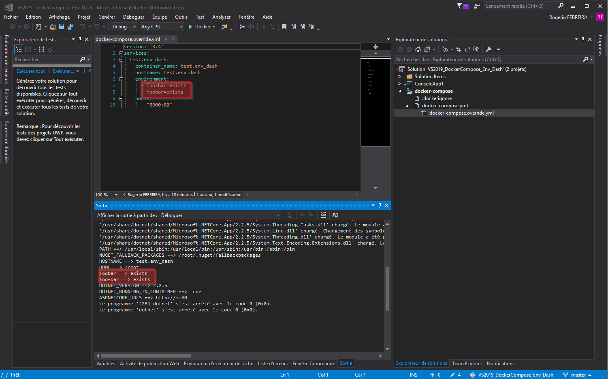
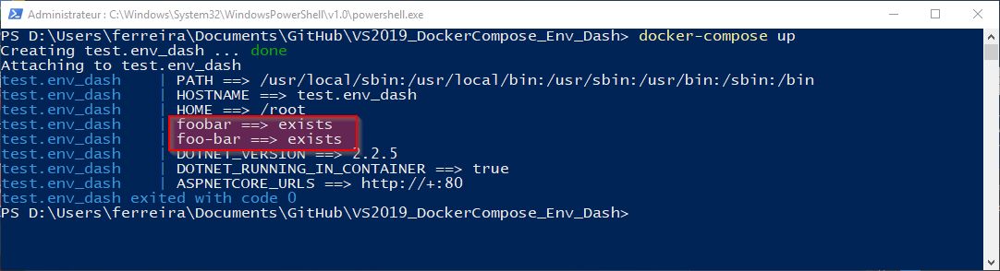

Simple demo of a bug in VS 2019 (16.1.0) with docker-compose when an environment variables contains a dash in it.
This one is not retrieved in the .NET Core project.
This behavior does not occure with VS 2017 (15.9.12) neither directly in console (docker-compose version 1.24.0, build 0aa59064)

## From Visual Studio 2019

## From Visual Studio 2017

## From Console
